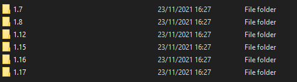
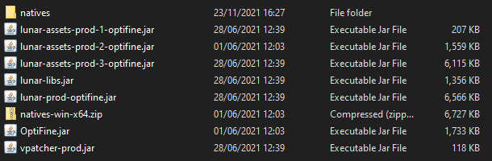
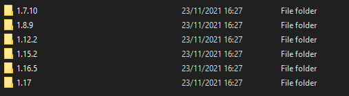
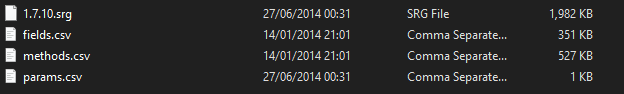
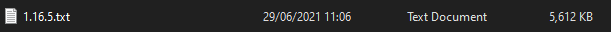
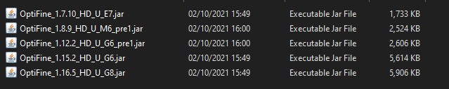

# LunarRemapper
The Mixin re-mapper for Lunar Client.
I have little time to work on this project, if you know what you're doing and have familiarized yourself with this (terrible) source code, please feel free to make some PRs.

# <!> Update

For newer lunar versions, please add a blank file with the full version name in the JAR, example: 1.8 will have a blank `1.8.9` file within the `lunar-prod` JAR.

# Usage

To setup this tool, you are required to add your client files under the `input` folder, in the following structure:

Where each folder contains the following:

## Mappings

You must create a mappings folder in the root of the project with this structure:

Where each folder contains the mapping files:

OR

For versions that do not use the Searge mapping format.

## OptiFine

In case the automatic downloading of OptiFine fails, you must add your optifine jars in the `optifine` folder in the root of the project.

